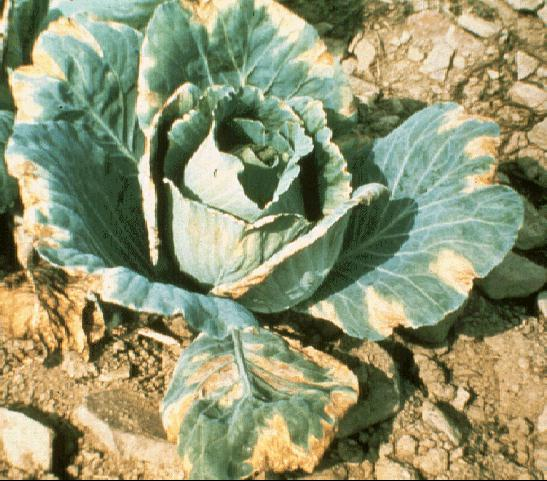
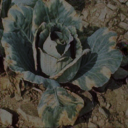

# Aprimoramento do Dataset PlantSeg

Este repositório configura um ambiente completo para o treinamento de modelos de segmentação de imagens utilizando o PlantSeg e o MMSegmentation. Além disso, ampliamos o dataset original gerando novas imagens sintéticas com o auxílio do repositório PyTorch-CycleGAN-and-pix2pix.

- [PlantSeg](https://github.com/tqwei05/PlantSeg): PlantSeg é um dataset inovador para segmentação de doenças em plantas, com 11.400 imagens, detalhadas máscaras e aplicações práticas.


- [Pytorch-CycleGAN-and-pix2pix](https://github.com/junyanz/pytorch-CycleGAN-and-pix2pix): Um projeto visionário que trouxe inovações em modelos GAN para tarefas de tradução de imagens e foi uma inspiração para a exploração de técnicas avançadas de aprendizado profundo.


# Nosso objetivo


O projeto amplia o dataset PlantSeg utilizando o CycleGAN para gerar imagens sintéticas que simulam condições reais de campo. Essas imagens enriquecem a diversidade do dataset, permitindo treinar modelos robustos, como o SegNeXt, para segmentação de doenças em plantas. A abordagem incremental avalia o impacto da expansão no desempenho do modelo, utilizando métricas como MIoU e mAcc. O objetivo é aprimorar a precisão e a generalização de modelos aplicados à agricultura de precisão, reduzindo perdas causadas por doenças e contribuindo para a produtividade agrícola.

**Imagem original (547x481)**




**Imagem sintética (256x256)**



# Dataset 

O dataset original do PlantSeg está disponível no [repositório oficial](https://github.com/tqwei05/PlantSeg). Contudo, disponibilizamos uma versão aprimorada contendo as imagens sintéticas geradas para facilitar experimentos e análises.

- Acesse nosso dataset expandido com imagens sintéticas:
- [Dataset sintético](https://drive.google.com/drive/folders/1r3S3hff-WnDU__smNdIIPbSjkdofuR8e?usp=drive_link)

#### Organização do dataset
1. Estrutura do dataset gerado:

- As imagens sintéticas (fakes) estão armazenadas em:
```planteg/images/fakes```

- Para utilizá-las no treinamento, mova-as para o diretório de treino:
 ```planteg/images/train```
 
2. Atualização do metadata:

- Concatene os dois arquivos de metadados:
    - ```Metadata.csv``` (caminhos das imagens originais)
    - ```Metadata_final.csv``` (caminhos das imagens sintéticas)

Isso garante que o modelo considere as novas imagens geradas durante o treinamento.

#### Como usar

Oferecemos duas formas de configurar o ambiente necessário para o treinamento, ambas exigindo o uso de uma GPU com suporte a CUDA:
```AMNS/Docker``` 

1. Ambiente Virtual - ```AMNS/Ambiente_Virtual```

Siga as instruções do README.md localizada na pasta.

2. Docker - ```AMNS/Docker```

Siga as instruções do README.md localizada na pasta.


#### Configuração do Dataset

1. crie uma pasta para o dataset:
```mkdir AMNS/dataset```

2. Faça o download do dataset original ou do dataset expandido e salve-o na pasta criada.

3. Siga as instruções de criação dos ambientes para modificar os caminhos se necessário

4. Para realizar testes com diferentes combinações de imagens originais e sintéticas, utilize a opção ```train_meta``` no Makefile. Basta modificar o caminho em ```METADATA_SOURCE```, sem a necessidade de recompilar o ambiente.

#### Sobre o CycleGAN

O repositório PyTorch-CycleGAN-and-pix2pix foi utilizado para gerar as imagens sintéticas sem exigir configurações extras além de uma GPU com suporte a CUDA. Para mais informações sobre o uso e configuração, visite o [repositório oficial](https://github.com/junyanz/pytorch-CycleGAN-and-pix2pix).


# Relatório

### 1. Introdução

A agricultura é um pilar econômico do Brasil, desempenhando um papel vital na segurança alimentar e no comércio internacional. Contudo, as doenças de plantas representam uma ameaça significativa à produtividade agrícola, podendo causar perdas de até 40% nas colheitas globais. Métodos tradicionais de diagnóstico, embora confiáveis, são limitados pela disponibilidade de especialistas e pelo tempo necessário para análises detalhadas.

No contexto brasileiro, a detecção de doenças em plantas é frequentemente dificultada pela falta de datasets robustos que representem adequadamente a diversidade de condições ambientais. Para enfrentar esse desafio, utilizamos o dataset PlantSeg, que se destaca por suas anotações de segmentação detalhadas e imagens coletadas em ambientes naturais, como base para desenvolver e testar técnicas de geração de dados sintéticos com CycleGAN. Nosso objetivo é incrementar o dataset original e avaliar o impacto dessa expansão no desempenho de modelos supervisionados, como o SegNeXt.

### 2. Fundamentos teóricos

- **Geração de Imagens Sintéticas com CycleGAN**

O CycleGAN (Cycle-Consistent Generative Adversarial Network) é uma técnica de aprendizado de máquina não supervisionado voltada para a transformação de imagens entre dois domínios diferentes. A ideia central é permitir que imagens sejam "convertidas" de um estilo para outro sem a necessidade de pares correspondentes, ou seja, sem que exista uma imagem no domínio de origem que tenha uma equivalente no domínio de destino.

Na prática, o CycleGAN utiliza duas redes geradoras e duas redes discriminadoras. As redes geradoras transformam imagens entre os dois domínios (exemplo: de dia para noite e vice-versa), enquanto as discriminadoras avaliam se as imagens geradas são realistas. Um dos principais diferenciais do CycleGAN é a consistência cíclica: ao transformar uma imagem de um domínio para o outro e depois retornar ao domínio original, ela deve permanecer similar à imagem inicial. Isso garante que as características essenciais da imagem sejam preservadas, evitando alterações irreais.

No contexto deste trabalho, o CycleGAN é usado para gerar imagens estilizadas do dataset PlantSeg, simulando condições ambientais comuns no campo, como baixa luminosidade, entardecer e mudanças de saturação. Essas variações ajudam a aumentar a diversidade do dataset, permitindo que os modelos de aprendizado de máquina treinados com essas imagens sejam mais robustos e generalizáveis para cenários reais.

- **Dataset PlantSeg**

O artigo PlantSeg: A Large-Scale In-the-wild Dataset for Plant Disease Segmentation apresenta um dos maiores e mais abrangentes datasets voltados para segmentação de doenças em plantas, abordando desafios críticos em agricultura de precisão. O PlantSeg foi projetado para superar as limitações de datasets anteriores, como falta de anotações detalhadas, baixa diversidade ambiental e escala reduzida.

I - Segmentação de alta qualidade: Cada imagem do PlantSeg é acompanhada de máscaras de segmentação detalhadas, feitas por especialistas e revisadas por patologistas. Essas máscaras identificam, de forma precisa, as áreas afetadas por doenças.

II - Diversidade de cenários: Ao contrário de outros datasets capturados em condições controladas de laboratório, o PlantSeg inclui imagens coletadas em ambientes naturais, ou "in-the-wild". Isso adiciona variabilidade em fatores como iluminação, ângulos de captura e complexidade do fundo, tornando os modelos treinados mais aplicáveis ao mundo real.

III - Escala e variedade: O dataset contém 11.458 imagens cobrindo 115 categorias de doenças em 34 espécies de plantas, incluindo culturas de alta relevância econômica, como trigo, milho e tomate. Essa amplitude garante que o PlantSeg seja representativo de uma ampla gama de doenças e condições agrícolas.

IV - Relevância prática: O PlantSeg foi projetado para servir como base para o desenvolvimento e a avaliação de modelos avançados de segmentação, como o SegNeXt, que obteve o melhor desempenho no baseline do dataset (MIoU de 44,52% e mAcc de 59,95%).

O PlantSeg é um marco no campo da segmentação de doenças em plantas, pois atende a uma necessidade crítica do setor agrícola: a disponibilidade de dados reais e detalhados para o treinamento de modelos robustos. Ele não apenas fornece um benchmark para comparação de modelos, mas também contribui para o avanço de sistemas automatizados que podem melhorar a produtividade agrícola e reduzir perdas devido a doenças.


### Metodologia

O desenvolvimento deste trabalho foi organizado em quatro etapas principais: geração de imagens sintéticas, treinamento incremental do modelo SegNeXt, avaliação de desempenho e validação dos resultados.

- **Geração de Imagens Sintéticas**

Para aumentar a diversidade do dataset PlantSeg, utilizamos o CycleGAN como ferramenta para criar imagens estilizadas, simulando variações ambientais comuns no campo. As condições reproduzidas incluem baixa luminosidade, brilho elevado e entardecer, refletindo os desafios encontrados em cenários reais. Esse processo gerou incrementalmente conjuntos de 500, 1.000, 1.500 e 2.000 imagens adicionais, que foram integradas ao dataset original.

Optamos pelo CycleGAN devido à sua eficiência em gerar imagens estilizadas sem a necessidade de pares correspondentes, algo inviável no nosso contexto pela ausência de imagens pareadas com variações ambientais. Diferente de técnicas tradicionais de data augmentation (como rotação, escala ou corte), o CycleGAN preserva as características estruturais originais da imagem, modificando apenas o estilo visual de forma realista. Isso garante que as novas imagens geradas adicionem variabilidade relevante ao dataset, sem comprometer a integridade dos dados.

Além disso, a capacidade do CycleGAN de transformar imagens entre domínios torna-o mais adequado para reproduzir condições ambientais adversas encontradas no campo, como iluminação irregular e mudanças de saturação. Essa abordagem contribui para o aumento da capacidade de generalização do modelo treinado, tornando-o mais robusto em cenários reais.

- **Treinamento Incremental com SegNeXt**

O modelo SegNeXt foi escolhido devido ao seu desempenho superior no baseline do PlantSeg, com destaque para métricas como MIoU e mAcc. O treinamento foi realizado de forma incremental, incorporando os conjuntos de imagens geradas em cada etapa ao dataset original. A configuração de treinamento incluiu o uso de um otimizador Stochastic Gradient Descent (SGD), com taxa de aprendizado de 0,001 e função de perda baseada em entropia cruzada. O modelo foi avaliado continuamente após cada incremento no número de imagens, permitindo analisar como a expansão do dataset impactava o desempenho.

- **Avaliação de Desempenho**

Para mensurar o impacto das imagens sintéticas, utilizamos duas métricas principais:

I - Mean Intersection over Union (MIoU): Mede a sobreposição média entre as predições do modelo e os rótulos verdadeiros, avaliando a precisão da segmentação.

II- Mean Accuracy per Class (mAcc): Calcula a precisão média por classe, fornecendo insights sobre a performance do modelo em identificar corretamente os diferentes tipos de doenças.
Essas métricas foram utilizadas para comparar os resultados de cada conjunto incremental de imagens estilizadas com o baseline do PlantSeg, estabelecendo uma visão clara da evolução do desempenho.

- **Validação dos Resultados**

A última etapa consistiu em validar os resultados obtidos com base nos benchmarks fornecidos pelo artigo "A Large-Scale In-the-wild Dataset for Plant Disease Segmentation" e nos dados apresentados no slide. Essa análise permitiu verificar se o uso das imagens estilizadas geradas pelo CycleGAN realmente contribuiu para melhorar a precisão e a robustez do modelo SegNeXt em relação ao baseline original.

## Resultados Baseline

Data Model SegNext   | Encoder | mIoU | mAcc 
---                  | ---  | ---   | ---                  
Original Data   | MSCAN-L |  0.8000  |  2.9600 |  
+1000 Imagens | MSCAN-L |  1.6800  |  4.8200 |  
+1500 Imagens	| MSCAN-L |  2.0000  |  6.3300 |  
+2000 Imagens | MSCAN-L |  2.3000  |  5.9600 |  


## [Slides apresentação](https://www.canva.com/design/DAGZNzUStv0/tCzXHqq_FzWE397iwql-zA/edit?utm_content=DAGZNzUStv0&utm_campaign=designshare&utm_medium=link2&utm_source=sharebutton)


### Reparos no repositório PlantSeg

Adicionamos um ajuste no código para investigar o que identificamos como possíveis referências a classes inexistentes durante o treinamento, o que estava resultando em falhas de execução. 

- [Repositório com adaptação](https://github.com/LisandraMoura/PlantSeg_AMNS)

#### Arquivos reparados:

- PlantSeg/configs/base/datasets/plantseg115.py
- PlantSeg/configs/segnext/segnext_mscan-t_1xb16-adamw-40k_plantseg115-512x512.py

# Referências 
Wei, T., Chen, Z., Yu, X., Chapman, S., Melloy, P., & Huang, Z. (2024). PlantSeg: A Large-Scale In-the-wild Dataset for Plant Disease Segmentation. Disponível em: https://arxiv.org/abs/2409.04038.

GitHub - CycleGAN and Pix2Pix: O código e a implementação utilizados para a geração de imagens estilizadas foram baseados no repositório oficial do CycleGAN, disponível em: https://github.com/junyanz/pytorch-CycleGAN-and-pix2pix/tree/master/datasets.

